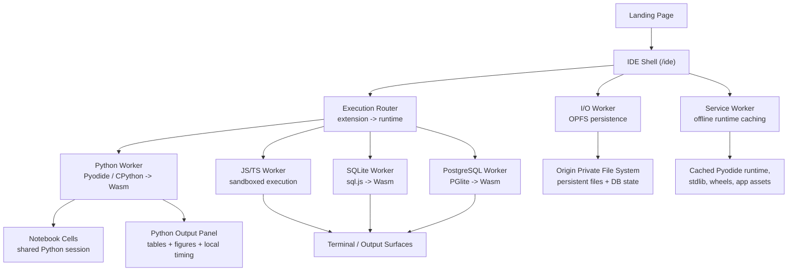

<div align="center">
  

  # WasmForge

  **A local-first browser IDE and Python notebook that keeps working after Airplane Mode.**

  [](https://wasm-forge.vercel.app/)
  [](https://gehu.in/hack)
  

</div>

WasmForge is a browser-first dev and data environment where Python, Python notebooks, JavaScript, TypeScript, SQLite, and PostgreSQL run on the user's own machine through WebAssembly.

For the browser-native core, there is no execution backend. After the first load, there is no network dependency either.

WasmForge now also includes an **optional local-native bridge** for host toolchains. That mode stays offline and serverless in the no-cloud sense, but it is intentionally not presented as a pure browser runtime.

**[→ Open the live demo](https://wasm-forge.vercel.app/)**  
Landing page: `/`  
IDE: `/ide`

---

## What Makes WasmForge Different

Most web IDEs still depend on remote compute. They may look local, but the actual runtime lives on a server, so a network drop kills execution, persistence becomes someone else's infrastructure problem, and every run depends on cloud resources.

WasmForge removes that layer entirely:

- Python runs through Pyodide in a dedicated Worker
- Python notebooks run in the same browser-native Python runtime with shared cell state
- SQLite runs through `sql.js`
- PostgreSQL runs through `PGlite`
- files persist through OPFS
- runtimes and wheels are cached by a Service Worker for offline reuse
- synchronous `input()` works through `SharedArrayBuffer` and `Atomics`

This is not a cloud IDE with an offline badge. It is a local-first browser runtime.

---

## What We Shipped

### 1. Real Offline Proof Flow

The app does not just claim offline support. It includes a visible proof path inside the IDE:

- warm the runtime once
- click `⚡ Offline-ready`
- prepare the demo workspace
- turn on Airplane Mode
- hard refresh `/ide`
- run Python again
- answer `input()`
- get output immediately from local runtime state

That proof flow is implemented in the product, not only in the README.

### 2. Python Notebook Mode

WasmForge now supports a scoped Python notebook mode with `.wfnb` files:

- cell-based editing
- shared Python session across cells
- inline stdout and stderr
- inline pandas DataFrame rendering
- inline Matplotlib figure rendering
- restartable Python session
- persistence through reloads and browser restarts
- offline rerun after runtime warmup

This is intentionally scoped and honest: it is a focused Python notebook, not a fake Jupyter clone.

### 3. Inline Data Output

Python output is no longer terminal-only:

- `display(df)` renders a structured DataFrame table inline
- `plt.show()` renders the plot inline
- regular stdout/stderr still works
- execution timing and local-runtime proof remain visible

### 4. Multi-File Python Imports

Python in WasmForge supports sibling-file imports inside the current workspace:

- `main.py` can import `helper.py`
- helper files can import bundled packages such as NumPy
- edits to imported modules are picked up correctly across reruns in the same worker session

The current workspace model is still flat, so this is hardened multi-file import support, not full nested package UX.

### 5. URL-Based Code Sharing

WasmForge can share the active file through a backend-free URL:

- the current editor state is encoded into the URL hash
- opening that URL creates a dedicated `shared-*` workspace
- the imported file can be run immediately
- reload persistence still works afterward

This is intentionally scoped to single-file sharing.

### 6. Local Execution Proof

Python runs surface visible proof that execution happened on the current device:

- terminal completion line
- output panel summary
- execution duration
- local-runtime wording that is clear in demos

That makes the core claim visible instead of hidden in architecture alone.

---

## Supported Files

| File | Runtime | Output Surface |
|------|---------|----------------|
| `.wfnb` | Python notebook session via Pyodide | Inline cell output, DataFrames, Matplotlib |
| `.py` | Pyodide (CPython 3.13 -> Wasm) | Terminal + Python output panel |
| `.js` | Sandboxed JS Worker | Terminal |
| `.ts` | Sucrase -> JS Worker | Terminal |
| `.sql` | `sql.js` (SQLite -> Wasm) | Results grid + schema inspector |
| `.pg` | `PGlite` (PostgreSQL -> Wasm) | Results grid + schema inspector |

**Bundled Python packages for offline use:** NumPy, pandas, matplotlib, python-dateutil, pytz, six, tzdata, plus required plotting dependencies.

### Optional Host Toolchains

If you start the local bridge with `npm run bridge`, WasmForge can detect host toolchains already installed on the same machine and run extra languages against a temporary local snapshot of the current workspace.

- current bridge runners: C, C++, Go, Rust, Java, Zig
- files stay editable in the IDE and persist through the existing workspace/local-folder flows
- execution stays offline and local
- this mode uses a localhost companion process, so it is **not** part of the pure in-browser claim

---

## What A Judge Can Verify Live

If you only have one minute to understand the product, verify these:

### Offline Reload Proof

1. Open [the live demo](https://wasm-forge.vercel.app/ide)
2. Click `⚡ Offline-ready`
3. Click `Prepare Demo Workspace`
4. Turn on Airplane Mode
5. Hard refresh `/ide`
6. Run `main.py`
7. Enter a name at the prompt

You should still see:

- `offline-proof ok for <name>`
- `helper-import ok 20`
- local execution timing

### Notebook Proof

1. Create a notebook
2. Run a setup cell that defines a variable
3. Run a second cell that uses it
4. Render a DataFrame
5. Render a Matplotlib figure
6. Refresh and rerun

That demonstrates shared Python session state, inline rich output, persistence, and offline-ready notebook execution.

### Share Proof

1. Open any file
2. Click `Share`
3. Open the copied link in a new tab
4. Run the imported file

The receiver gets a dedicated `shared-*` workspace with the shared file already loaded.

---

## System Architecture



### Why the UI stays responsive

User code never runs on the main thread.

- Python, JS/TS, SQLite, PostgreSQL, and file I/O all run in Workers
- the UI stays interactive even if code blocks or crashes
- Python infinite loops are contained by a watchdog that terminates and respawns the worker

### Why `input()` works

Python `input()` is synchronous, so WasmForge uses `SharedArrayBuffer` and `Atomics.wait()` to block only the Python Worker while the terminal collects input from the user.

### Why files survive reloads

Editor changes are persisted into the Origin Private File System through a dedicated I/O Worker. That includes regular source files, notebook files, and SQL state.

### Why Airplane Mode still works

The runtime assets, wheels, Wasm binaries, and app bundle are cached locally by the Service Worker. After the first warm load, `/ide` can reload from cache instead of a server.

---

## Tech Stack

| Technology | Role |
|-----------|------|
| React 18 | UI shell, routing, orchestration |
| Vite + `vite-plugin-pwa` | build pipeline, Service Worker generation |
| Monaco Editor | code editing surface |
| Pyodide | CPython 3.13 compiled to WebAssembly |
| `sql.js` | SQLite compiled to WebAssembly |
| `PGlite` | PostgreSQL compiled to WebAssembly with browser persistence |
| Xterm.js | terminal surface |
| Sucrase | runtime TypeScript transpilation |
| Web Workers | isolated execution and OPFS I/O |
| OPFS | persistent local storage |
| `SharedArrayBuffer` + `Atomics` | synchronous `input()` without freezing the UI |

---

## Verification

WasmForge ships end-to-end verification scripts for the core claims:

```bash
npm run verify:ide
npm run verify:notebook
npm run verify:share
npm run verify:mobile
npm run verify:claims
npm run verify:all
```

What they cover:

- Python, JavaScript, TypeScript, SQLite, PostgreSQL
- notebook shared-session behavior
- inline DataFrame rendering
- inline Matplotlib rendering
- share-link import flow
- offline proof flow
- persistence across reload and browser restart
- service worker control and cached runtime assets
- JS kill recovery
- Python watchdog recovery

---

## Local Setup

```bash
git clone https://github.com/Yumekaz/WasmForge.git
cd WasmForge
npm install
npm run dev
```

Open `http://localhost:5173` for the landing page or `http://localhost:5173/ide` for the IDE.

Verify cross-origin isolation in DevTools:

```js
window.crossOriginIsolated
```

This must be `true` for synchronous `input()` support.

### Optional Host Bridge

In a second terminal, start the optional local-native bridge:

```bash
npm run bridge
```

Then click `Host Bridge` inside the IDE. WasmForge will probe localhost, detect installed host toolchains, and route supported non-browser languages through that bridge.

### Production Preview

```bash
npm run build
npm run preview
```

Then open `/ide`, let the Service Worker take control, and test the offline proof flow.

---

## Repository Structure

```text
src/
├── App.jsx                      - main IDE shell, routing, runtime orchestration
├── main.jsx                     - landing vs IDE route handling
├── components/
│   ├── Editor.jsx               - Monaco integration
│   ├── FileTree.jsx             - explorer, file actions, notebook creation
│   ├── LandingPage.jsx          - branded landing page
│   ├── OfflineProofPanel.jsx    - visible offline proof flow
│   ├── PythonNotebook.jsx       - scoped Python notebook UI
│   ├── PythonOutputPanel.jsx    - inline Python tables, figures, execution proof
│   ├── SchemaInspector.jsx      - SQL schema browser
│   ├── SqlResultsPanel.jsx      - SQL results grid
│   └── Terminal.jsx             - Xterm.js terminal surface
├── hooks/
│   ├── useIOWorker.js           - OPFS abstraction
│   ├── useJsWorker.js           - JS/TS runtime management
│   ├── usePyodideWorker.js      - Python lifecycle, notebook calls, watchdog recovery
│   └── useSqlWorkers.js         - SQLite and PostgreSQL runtime management
├── utils/
│   ├── pythonNotebook.js        - notebook document format + helpers
│   └── sqlRuntime.js            - runtime routing
└── workers/
    ├── io.worker.js             - OPFS sync writes
    ├── js.worker.js             - JS/TS sandbox
    ├── pglite.worker.js         - PostgreSQL runtime
    ├── pyodide.worker.js        - Python runtime, notebook cells, plots, tables
    └── sqlite.worker.js         - SQLite runtime

scripts/
├── verify-ide.mjs               - main IDE verification
├── verify-notebook.mjs          - notebook verification
├── verify-share.mjs             - share-flow verification
├── verify-mobile-ui.mjs         - mobile-shell verification
└── verify-claims.mjs            - offline/cache/restart proof verification
```

---

## Final Claim

WasmForge is not trying to be a prettier cloud IDE.

It is trying to prove something more interesting:

**a browser tab can be a real local dev and data environment, with no backend runtime, no post-load network dependency, and no collapse when the internet disappears.**

And when the pure browser boundary is not enough, the optional local-native bridge extends that same local-first model to host compilers without introducing any cloud dependency.

That is the bet this project is making.

---

**Team Codeinit — Watch The Code 2026 — PS #10: WebIDE**
